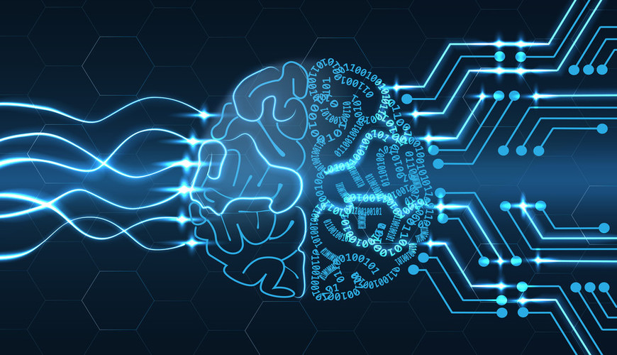
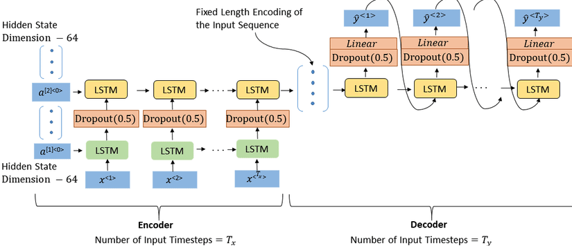

# Drum_AI


A project where an AI is taught to play drums using guitar notes as an input. A deep learning based architecture is used order to achieve atleast a pattern of an initial recommendation of the drum beats a user can use to further work on it. The project was implimented using Pytorch framework. 

# Prereqisites

OS type and version: macOS Catalina, Version 10.15.7,

System type: 64-bit OS, x64-based processor

Python version: >=3.6


# Overview



This project utilises a encoder- decoder architecture of LSTM cells which takes in a tensor of guitar notes(converted from midi) and generates the drum notes.  The ```main.py``` script provides an option of either training the model from scratch using input and target numpy arrays or the inference mode which takes in the file name of the midi file for which the drum beats need to be generated. 

The ```pre-process_utils.py``` script takes in the input and target numpy arrays and provides a clean data with a sequence limit of 150 notes for input and generated target.
*Note : In order to run the pre-process_utils.py script the midi files need to be converted into numpy arrays for which you can reference the notebook midi-to-notes.ipynb*

The ```data_prep.py``` script converts the input and target numpy arrays into torch tensors which are then padded, batched and returned as iterators to be utilised for training. The ```Seq_model.py``` consists of the model architecture namely the Encoder class, Decoder class and the  Seq2Seq class which is the interface class between the encoder and decoder. 

```Music_utils.py``` consists of functions used to convert the generated output to midi files. This script utilises the Stanford ```music21``` library.

Model weights can be found [here](https://drive.google.com/drive/folders/1NzLDSc3_yGKCh58JpTvEzDoB7D-vK_NE?usp=sharing)

# Dataset 
In order to make this project possible I had utilised a dataset containing of jazz music which had a mix of guitar, piano and drum beats. [Link](https://www.kaggle.com/saikayala/jazz-ml-ready-midi)

# Run Demo
In order to execute the project you would have to use ```python3 main.py```.

# Observations 
The loss decreases from 5.4 to 1.79 in 600 epochs.

# Future works 
Use attention based Encoder decoder architecture to train the model.<br>
Using transformers to see if there is a speed up in inference of the model and unique generation of drum beats. 


